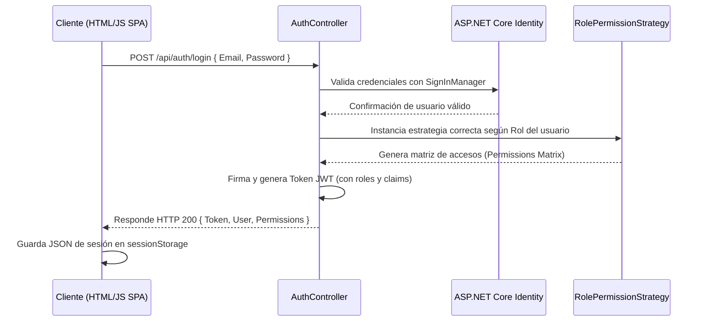

# Arquitectura de Software — OdontoPlus

Este documento detalla el diseño de software, patrones arquitectónicos, flujo de datos y modelo de seguridad implementados en el proyecto **OdontoPlus**.

---

## 1. Estructura del Proyecto (Backend)

El backend está desarrollado bajo la plataforma **ASP.NET Core Web API 8.0** utilizando una arquitectura organizada por responsabilidades:

```text
backend/
├── Controllers/       # Controladores API REST que gestionan las peticiones HTTP
├── Data/              # Contexto de Entity Framework Core (ApplicationDbContext) y migraciones
├── Models/            # Modelos de dominio mapeados a la base de datos y esquemas de Identity
├── Repositories/      # Capa de abstracción de datos (Patrón Repository y Unit of Work)
├── Services/          # Servicios globales del sistema (Patrón Singleton)
└── Strategies/        # Algoritmos de autorización según el rol (Patrón Strategy)
```

### Contenido de las carpetas:
* **Models:** Define la estructura de datos física de la aplicación (`Paciente`, `Cita`, `ArticuloInventario`, etc.) y extiende `IdentityUser` para el manejo de credenciales de usuario.
* **Repositories:** Contiene las interfaces y clases genéricas para desacoplar el motor de base de datos de la lógica del negocio.
* **Controllers:** Expone los endpoints RESTful (`/api/patients`, `/api/appointments`, etc.) protegidos por roles mediante políticas de autorización nativas.
* **Strategies:** Encapsula el cálculo de permisos en tiempo de ejecución para cada tipo de rol.
* **Services:** Configura servicios compartidos persistentes en toda la aplicación.

---

## 2. Patrones de Diseño Implementados

### A. Patrón Singleton (`GlobalSettingsService.cs`)
* **Problema que resuelve:** Evita la recreación innecesaria de objetos que almacenan parámetros compartidos o configuraciones globales del sistema. Al registrarse como un servicio único en el contenedor DI de .NET, garantiza que todos los controladores y servicios accedan a la misma instancia centralizada, ahorrando memoria y previniendo inconsistencias.

### B. Patrón Repository y Unit of Work (`IRepository.cs` y `IUnitOfWork.cs`)
* **Problema que resuelve:** Desacopla la lógica de negocio del acceso directo a la base de datos (Entity Framework). El Repositorio Genérico abstrae las operaciones CRUD comunes, mientras que el *Unit of Work* agrupa múltiples operaciones en una única transacción transaccional atómica, asegurando que todos los cambios se guarden juntos o ninguno se aplique en caso de error.

### C. Patrón Strategy (`RolePermissionStrategy.cs`)
* **Problema que resuelve:** Evita la anidación excesiva de condicionales `if/else` o `switch` dispersos por todo el sistema para evaluar si un usuario puede ver o modificar un módulo. Al encapsular la evaluación de permisos dentro de estrategias concretas por cada rol (`AdminPermissionStrategy`, `DoctorPermissionStrategy`, etc.), permite modificar o añadir nuevas reglas de acceso de manera limpia sin alterar el código existente.

---

## 3. Flujo Completo de Autenticación y Autorización



1. **SPA envía credenciales:** El frontend captura el email/contraseña y hace un `POST` asíncrono a `/api/auth/login`.
2. **Validación:** El `AuthController` delega la comprobación a `SignInManager` de Identity y recupera el rol de la base de datos SQLite.
3. **Resolución de la Estrategia:** Se evalúa el rol del usuario contra `RolePermissionStrategy` para calcular qué secciones de la aplicación (`pacientes`, `agenda`, `inventario`, `facturacion`) puede ver, crear, editar o eliminar.
4. **Token y Respuesta:** Se genera un JWT firmado con expiración de 7 días. El servidor responde con el Token, la información básica del usuario y el mapa de permisos resultante.
5. **Guardado en Cliente:** La SPA guarda este objeto en `sessionStorage` para mantener la sesión y renderizar dinámicamente el panel lateral (sidebar).

---

## 4. Conexión Frontend-Backend (Consumo de la API)

* **Fetch API:** El frontend de Vanilla JS realiza llamadas HTTP a `http://localhost:5000/api/...` mediante funciones asíncronas (`async/await`).
* **Bearer Token:** Para toda petición a recursos protegidos (ej. obtener lista de pacientes), el cliente extrae el token del `sessionStorage` e inyecta la cabecera de autenticación correspondiente:
  ```javascript
  headers: {
      'Authorization': `Bearer ${session.token}`,
      'Content-Type': 'application/json'
  }
  ```
* **CORS (Cross-Origin Resource Sharing):** El backend posee configurada una política CORS permisiva (`AllowSPA`) en `Program.cs` para habilitar el tráfico de cabeceras de autorización (`AllowAnyHeader`), peticiones asíncronas y cualquier verbo REST (`AllowAnyMethod`) desde orígenes externos.
